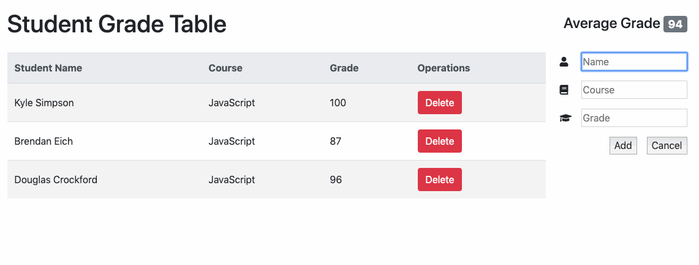

# sgt-react
A JavaScript application for teachers who want to manage course records.

## Technologies Used

 - React.js
 - Webpack 4
 - Bootstrap 4
 - Node.js
 - HTML5
 - CSS3
 - Font Awesome

 ## Live Demo

 Coming soon.

 ## Features

 - Teachers can view a list of recorded grades.
 - Teachers can view the average grade.
 - Teachers can add a grade to the table.
 - Teachers can delete a grade from the table.

## Preview


#### System Requirements

- Node.js 10 or higher
- NPM 6 or higher

#### Getting Started

1. Clone the repository.

    ```shell
    git clone https://github.com/cherie-pavicoTsukayama/sgt-react
    cd sgt-react
    ```

1. Install all dependencies with NPM.

    ```shell
    npm install
    ```

1. Start the project. Once started you can view the application by opening http://localhost:3000 in your browser.

    ```shell
    npm run dev
    ```
